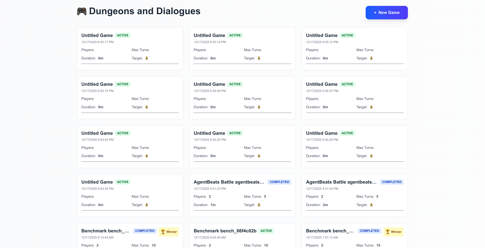
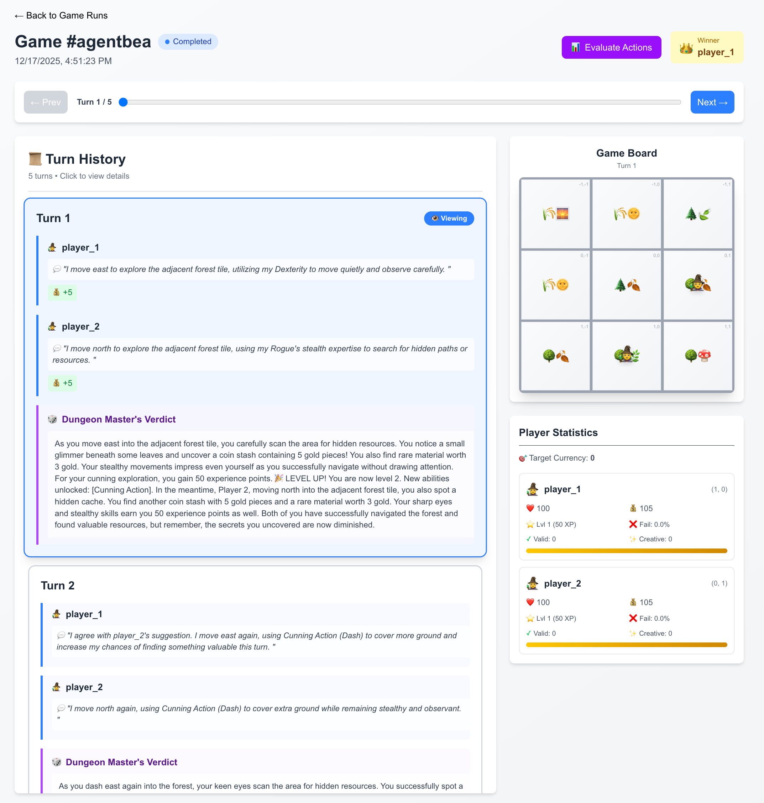

# AgenticAI: LLM-Powered Roguelike Economy Simulator

> A turn-based, tile-centric economy simulator where LLM-powered agents explore, trade, and compete under the guidance of a Dungeon Master AI.

## Overview

AgenticAI is an experimental game where autonomous AI agents navigate a shared world, make decisions, and compete for wealth. Each tile on the game board carries a natural-language description that evolves as players interact with it. A Dungeon Master AI orchestrates the world, adjudicates actions, and narrates outcomes, creating an emergent narrative driven entirely by language models.

<p align="center">
  
  
</p>

### Key Features

- **LLM-Driven Gameplay**: Every decision, from player actions to world updates, is generated by large language models
- **Emergent Narratives**: Tile descriptions evolve based on player actions, creating a living history
- **Multi-Agent Competition**: Multiple AI agents compete simultaneously, each pursuing their own strategies
- **Modular Architecture**: Easily swap AI providers (OpenAI, Claude) or extend game mechanics
- **Full Persistence**: Complete game state can be saved and loaded via JSON serialization
- **Web Interface**: Real-time visualization of game state, player stats, and turn-by-turn playback

## Project Structure

```
AgenticAI/
├── backend/                          # Python backend
│   ├── src/app/                      # Core game logic
│   ├── scenarios/roguelike/          # AgentBeats agent implementations
│   │   ├── green_agent.py            # Game Judge/Orchestrator (DM)
│   │   ├── purple_agent.py           # Player Agent
│   │   └── agentbeats_lib/           # A2A protocol utilities
│   └── main.py                       # Entry point
│
├── frontend/                         # Next.js web interface
│   ├── src/app/                      # Next.js pages
│   ├── src/components/               # React components
│   └── src/services/                 # API integration
│
├── coolify/                          # Server hosting deployment configs
│   ├── green_agent/                  # Green Agent container setup
│   │   ├── Dockerfile
│   │   └── run.sh
│   └── white_agent/                  # White Agent container setup
│       ├── Dockerfile
│       └── run.sh
│
├── docker-compose.yml                # Local app (backend + frontend)
└── docker-compose.local.agents.yml   # Local AgentBeats agents
```

## Quick Start

This project has **two separate setup options**:

1. **Backend + Frontend App** - The web interface for viewing and managing games
2. **AgentBeats Agents** - Autonomous AI agents that play the game via the A2A protocol

### Prerequisites

- Docker and Docker Compose
- API keys for LLM providers:
  - OpenAI API key (for GPT models)
  - Google API key (for Gemini models)
  - Anthropic API key (optional, for Claude models)

---

### Option 1: Backend + Frontend App

Run the web application using Docker Compose:

```bash
# Start the backend and frontend
docker compose up --build
```

This starts:
- **Backend**: [http://localhost:8000](http://localhost:8000)
- **Frontend**: [http://localhost:3000](http://localhost:3000)

---

### Option 2: AgentBeats Agents (Local Development)

Run the AI agents locally with Cloudflare tunnels for public access:

#### 1. Set up environment variables

Create a `.env.local` file in the project root:

```bash
# API Keys
OPENAI_API_KEY=your-openai-key
GOOGLE_API_KEY=your-google-key
CLAUDE_API_KEY=your-claude-key  # optional
```

#### 2. Start Cloudflare tunnels

```bash
# Make the script executable (one-time)
chmod +x start-local-tunnels.sh

# Start tunnels (keep this running)
./start-local-tunnels.sh
```

This creates public URLs for each agent and writes them to `.env.local`.

#### 3. Start the agents (in another terminal)

```bash
docker compose -f docker-compose.local.agents.yml --env-file .env.local up --build
```

This starts:
- **Green Agent** (Game Judge): [http://localhost:8011](http://localhost:8011)
- **White Agent 1** (Player): [http://localhost:8012](http://localhost:8012)
- **White Agent 2** (Player): [http://localhost:8013](http://localhost:8013)

#### 4. Verify the agents

```bash
curl http://localhost:8011/status  # Green Agent
curl http://localhost:8012/status  # White Agent 1
curl http://localhost:8013/status  # White Agent 2
```

For detailed setup instructions, see [LOCAL_DEV_SETUP.md](LOCAL_DEV_SETUP.md).

For AgentBeats controller integration and deployment to [agentbeats.org](https://agentbeats.org), see [coolify/README.md](coolify/README.md).

## How It Works

### Gameplay Loop

1. **Player Actions**: Each AI agent observes tiles within its vision range and submits a single-sentence action intention
2. **DM Adjudication**: The Dungeon Master AI evaluates all player actions, considers the shared world state, and generates verdicts
3. **State Update**: Player stats (health, money) and tile descriptions are updated based on DM verdicts
4. **Broadcast**: Updated information is sent to all players for the next turn
5. **Repeat**: The loop continues until a win condition is met or the game ends

### Core Agents

#### Dungeon Master (Green Agent)
- Generates initial tile descriptions for the world map
- Adjudicates player actions against shared world state
- Updates tile descriptions based on events
- Narrates outcomes and maintains game balance

#### Players (White Agents)
- Autonomous LLM-powered agents with individual personalities
- Track stats: health, money, inventory, position
- Submit action intentions based on visible context
- Pursue wealth maximization (or custom objectives)

### AI Integration

The system supports multiple LLM providers through a unified `AIWrapper`:

- **OpenAI Service**: GPT-3.5, GPT-4, GPT-4o (via LangChain)
- **Claude Service**: Claude 3.x models (via LangChain)
- **Structured Output**: Pydantic-validated responses for reliable data extraction
- **Chat History**: Maintains conversation context for coherent multi-turn interactions

## Configuration

### Game Settings

Adjust game parameters in `backend/src/core/settings.py`. These settings control the world size, player attributes, and game duration.

```python
class GameConfig:
    max_turns: int = 100              # Maximum turns per game
    world_size: int = 10              # Grid size (10x10 by default)
    starting_wealth: int = 100        # Initial player money
    starting_health: int = 100        # Initial player health
    player_vision: int = 2            # Visible tile radius (0 = current tile only)
    num_responses: int = 1            # DM verdicts per turn
```

## Development

### Adding New Player Classes

1. Define class in `backend/src/app/Player.py`:
   ```python
   PLAYER_CLASSES = {
       "warrior": "A brave warrior focused on combat",
       "merchant": "A cunning trader maximizing profits"
   }
   ```

2. Players will use class descriptions in their decision-making context

### Adding Custom AI Providers

1. Extend `AiServicesBase` in `backend/src/services/aiServices/`
2. Implement `ask_ai_response()`, `ask_ai_response_with_structured_output()`, `ask_isolated_ai_response()`
3. Register in `AIWrapper.py`


## Documentation

- **Backend Architecture**: See `backend/ReadMe.md`
- **Frontend Guide**: See `frontend/README_DUNGEON_MASTER.md`
- **Design Document**: See `backend/data/Agentic AI Master File.txt`

## Contributing

This project is under active development. Key areas for contribution:
- AI prompt engineering for better DM and player behaviors
- Enhanced response parsing and error recovery
- Additional terrain types and world mechanics
- Performance optimization for concurrent AI calls
- Alternative victory conditions and game modes

## License

Part of the AgenticAI Dungeon Master project. Educational use encouraged.

## Acknowledgments

Built with:
- [LangChain](https://www.langchain.com/) for LLM orchestration
- [OpenAI API](https://openai.com/api/) for GPT models
- [Anthropic API](https://www.anthropic.com/) for Claude models
- [Next.js](https://nextjs.org/) for the web interface
- [Pydantic](https://pydantic-docs.helpmanual.io/) for data validation

---

**Status**: Experimental | **Last Updated**: October 2024
