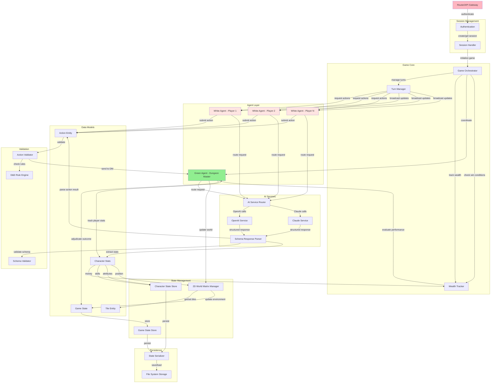

```mermaid
graph TB
    Router[Router/API Gateway]
    
    subgraph Session Management
        SessionHandler[Session Handler]
        Auth[Authentication]
    end
    
    subgraph Game Core
        GameOrchestrator[Game Orchestrator]
        TurnManager[Turn Manager]
        WealthTracker[Wealth Tracker]
    end
    
    subgraph Agent Layer
        GreenAgent[Green Agent - Dungeon Master]
        WhiteAgent1[White Agent - Player 1]
        WhiteAgent2[White Agent - Player 2]
        WhiteAgentN[White Agent - Player N]
    end
    
    subgraph AI Services
        AIRouter[AI Service Router]
        OpenAIService[OpenAI Service]
        ClaudeService[Claude Service]
        ResponseParser[Schema Response Parser]
    end
    
    subgraph State Management
        WorldMatrix[2D World Matrix Manager]
        GameStateStore[Game State Store]
        CharacterStateStore[Character State Store]
    end
    
    subgraph Data Models
        Tile[Tile Entity]
        Character[Character Stats]
        Action[Action Entity]
        GameState[Game State]
    end
    
    subgraph Persistence
        FileSystem[File System Storage]
        StateSerializer[State Serializer]
    end
    
    subgraph Validation
        RuleEngine[D&D Rule Engine]
        ActionValidator[Action Validator]
        SchemaValidator[Schema Validator]
    end
    
    Router -->|authenticate| Auth
    Auth -->|create/get session| SessionHandler
    SessionHandler -->|initialize game| GameOrchestrator
    
    GameOrchestrator -->|manage turns| TurnManager
    GameOrchestrator -->|track wealth| WealthTracker
    GameOrchestrator -->|coordinate| GreenAgent
    
    TurnManager -->|request actions| WhiteAgent1
    TurnManager -->|request actions| WhiteAgent2
    TurnManager -->|request actions| WhiteAgentN
    
    WhiteAgent1 -->|submit action| Action
    WhiteAgent2 -->|submit action| Action
    WhiteAgentN -->|submit action| Action
    
    Action -->|validate| ActionValidator
    ActionValidator -->|check rules| RuleEngine
    ActionValidator -->|send to DM| GreenAgent
    
    GreenAgent -->|route request| AIRouter
    WhiteAgent1 -->|route request| AIRouter
    WhiteAgent2 -->|route request| AIRouter
    WhiteAgentN -->|route request| AIRouter
    
    AIRouter -->|OpenAI calls| OpenAIService
    AIRouter -->|Claude calls| ClaudeService
    
    OpenAIService -->|structured response| ResponseParser
    ClaudeService -->|structured response| ResponseParser
    
    ResponseParser -->|validate schema| SchemaValidator
    ResponseParser -->|extract stats| Character
    ResponseParser -->|parse action result| Action
    
    GreenAgent -->|update world| WorldMatrix
    GreenAgent -->|adjudicate outcome| GameState
    GreenAgent -->|track player stats| Character
    
    WorldMatrix -->|get/set tiles| Tile
    WorldMatrix -->|update environment| GameState
    
    Character -->|money| WealthTracker
    Character -->|skills| CharacterStateStore
    Character -->|attributes| CharacterStateStore
    Character -->|position| WorldMatrix
    
    GameState -->|store| GameStateStore
    CharacterStateStore -->|persist| StateSerializer
    GameStateStore -->|persist| StateSerializer
    
    StateSerializer -->|save/load| FileSystem
    
    WealthTracker -->|evaluate performance| GreenAgent
    TurnManager -->|broadcast updates| WhiteAgent1
    TurnManager -->|broadcast updates| WhiteAgent2
    TurnManager -->|broadcast updates| WhiteAgentN
    
    GameOrchestrator -->|check win conditions| WealthTracker
    
    style GreenAgent fill:#90EE90
    style WhiteAgent1 fill:#FFE4E1
    style WhiteAgent2 fill:#FFE4E1
    style WhiteAgentN fill:#FFE4E1
    style Router fill:#FFB6C1
```